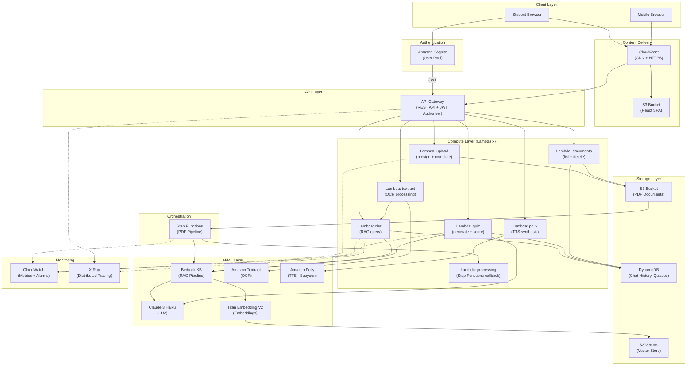
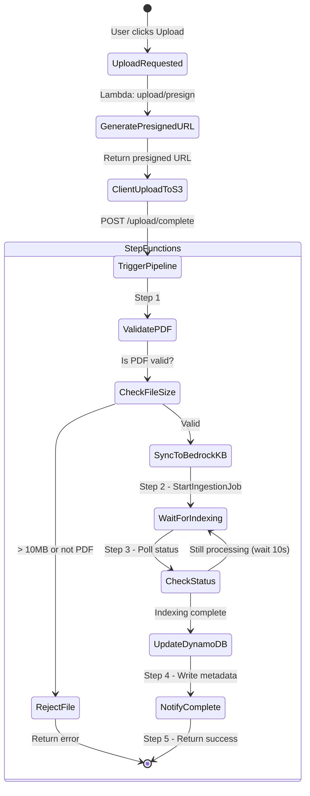
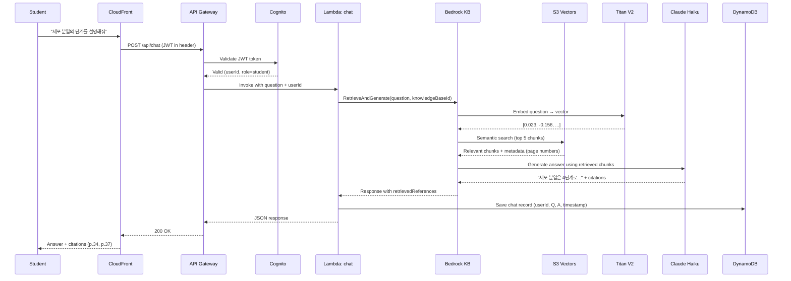
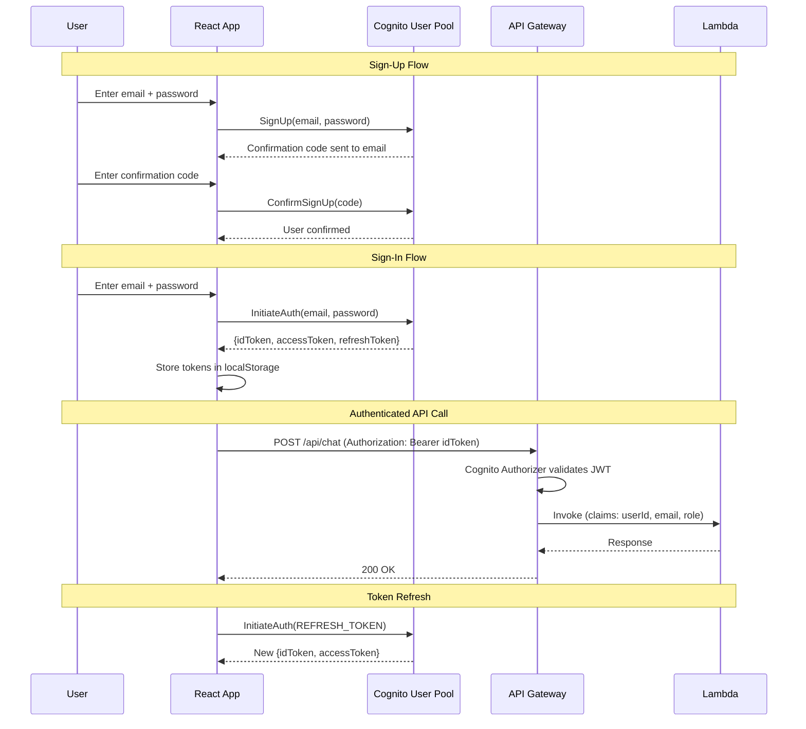
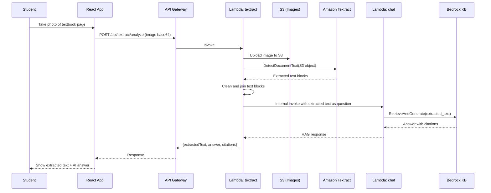

# StudyBot Enhanced — Architecture Diagrams

> Detailed text-based and Mermaid architecture diagrams for all system flows.

**Version:** v2.0 | **Date:** 2026-03-19

---

## 1. High-Level System Architecture (Mermaid)



---

## 2. User Flow — Student Journey

```
┌─────────────────────────────────────────────────────────────────┐
│                     STUDENT USER FLOW                           │
└─────────────────────────────────────────────────────────────────┘

  ┌──────┐    ┌──────────┐    ┌───────────┐    ┌──────────────┐
  │ Sign │───▶│  Upload   │───▶│  Ask      │───▶│  Generate    │
  │ Up / │    │  PDF      │    │  Question │    │  Quiz        │
  │ Login│    │  Textbook │    │           │    │              │
  └──────┘    └──────────┘    └───────────┘    └──────────────┘
     │             │               │                  │
     ▼             ▼               ▼                  ▼
  Cognito     S3 + Step       Bedrock KB +       Claude 3 Haiku
  (JWT)       Functions       Claude Haiku       (quiz generation)
                  │               │                  │
                  ▼               ▼                  ▼
             "Indexing       "Answer with       "5 questions
              complete!"      citations:         generated!
                              see p.34"          Score: 4/5"
                                  │
                          ┌───────┴───────┐
                          ▼               ▼
                    ┌──────────┐   ┌──────────┐
                    │  Listen  │   │  Photo   │
                    │  (TTS)   │   │  OCR     │
                    │  Polly   │   │ Textract │
                    └──────────┘   └──────────┘
                         │               │
                         ▼               ▼
                    "Audio plays     "Text extracted,
                     answer in        querying RAG..."
                     Korean"
```

---

## 3. PDF Upload + Processing Pipeline (Step Functions)



### ASCII Version

```
User                    API GW          Lambda:upload       S3            Step Functions      Bedrock KB
 │                        │                  │               │                 │                  │
 │  POST /upload/presign  │                  │               │                 │                  │
 │───────────────────────▶│─────────────────▶│               │                 │                  │
 │                        │                  │──── Generate ─▶               │                  │
 │                        │                  │◀─── URL ──────│               │                  │
 │◀──────── presigned URL─│◀─────────────────│               │                 │                  │
 │                        │                  │               │                 │                  │
 │  PUT (direct to S3)    │                  │               │                 │                  │
 │────────────────────────┼──────────────────┼──────────────▶│                 │                  │
 │                        │                  │               │                 │                  │
 │  POST /upload/complete │                  │               │                 │                  │
 │───────────────────────▶│─────────────────▶│               │                 │                  │
 │                        │                  │────── Start ──┼────────────────▶│                  │
 │◀──── jobId ────────────│◀─────────────────│               │                 │                  │
 │                        │                  │               │  Step 1: Validate               │
 │                        │                  │               │  Step 2: Sync ──┼─────────────────▶│
 │                        │                  │               │                 │  StartIngestion  │
 │                        │                  │               │  Step 3: Wait   │◀──── jobId ──────│
 │  GET /upload/status    │                  │               │  (poll loop)    │                  │
 │───────────────────────▶│─────────────────▶│               │      ...        │                  │
 │◀──── "processing" ─────│◀─────────────────│               │  Step 4: Done   │                  │
 │                        │                  │               │  Update DDB     │                  │
 │  GET /upload/status    │                  │               │                 │                  │
 │───────────────────────▶│─────────────────▶│               │                 │                  │
 │◀──── "ready" ──────────│◀─────────────────│               │                 │                  │
```

---

## 4. Chat Query Flow (RAG with Citations)



### Response JSON Structure

```json
{
  "answer": "세포 분열은 4단계로 진행됩니다: 전기, 중기, 후기, 말기...",
  "citations": [
    {
      "pageNumber": 34,
      "passage": "세포 분열의 첫 번째 단계인 전기에서는...",
      "score": 0.92
    },
    {
      "pageNumber": 37,
      "passage": "후기와 말기에서는 염색체가...",
      "score": 0.87
    }
  ],
  "conversationId": "conv-abc123",
  "timestamp": "2026-04-15T10:30:00Z"
}
```

---

## 5. Authentication Flow (Cognito)



### Cognito User Pool Configuration

```
User Pool:
  ├── Sign-in: email
  ├── Password policy: 8+ chars, uppercase, number, symbol
  ├── MFA: off (student convenience)
  ├── Custom attributes:
  │   ├── custom:role = "student" | "teacher"
  │   └── custom:school = string
  └── Groups:
      ├── students (default)
      └── teachers (dashboard access)

API Gateway Authorizer:
  ├── Type: Cognito User Pool
  ├── Token source: Authorization header
  └── Token validation: JWT signature + expiry
```

---

## 6. Quiz Generation Flow

```
┌──────────────────────────────────────────────────────────────┐
│                    QUIZ GENERATION FLOW                       │
└──────────────────────────────────────────────────────────────┘

Student clicks                Lambda:quiz              Claude 3 Haiku
"Generate Quiz"                   │                         │
     │                            │                         │
     │  POST /api/quiz/generate   │                         │
     │  {documentId, numQ: 5}     │                         │
     │───────────────────────────▶│                         │
     │                            │                         │
     │                            │  Retrieve top 10 chunks │
     │                            │  from Bedrock KB        │
     │                            │────────────────────────▶│
     │                            │                         │
     │                            │  Prompt:                │
     │                            │  "Generate 5 quiz Qs    │
     │                            │   from these chunks.    │
     │                            │   Include: 3 MCQ +      │
     │                            │   2 short answer.       │
     │                            │   Return as JSON."      │
     │                            │────────────────────────▶│
     │                            │                         │
     │                            │◀────── Quiz JSON ───────│
     │                            │                         │
     │                            │  Store quiz in DynamoDB │
     │                            │  (quizId, questions,    │
     │                            │   correct answers)      │
     │                            │                         │
     │◀──── Quiz Questions ───────│                         │
     │                            │                         │
     │  (Student answers)         │                         │
     │                            │                         │
     │  POST /api/quiz/submit     │                         │
     │  {quizId, answers: [...]}  │                         │
     │───────────────────────────▶│                         │
     │                            │  Compare with stored    │
     │                            │  correct answers        │
     │                            │  Calculate score        │
     │                            │  Store result in DDB    │
     │◀──── Score: 4/5 ──────────│                         │
```

---

## 7. OCR Flow (Textract)



---

## 8. Text-to-Speech Flow (Polly)

```
Student clicks "Listen"         Lambda:polly          Amazon Polly
on an answer                        │                     │
     │                              │                     │
     │  POST /api/polly/synthesize  │                     │
     │  {text: "세포 분열은...",     │                     │
     │   voiceId: "Seoyeon"}        │                     │
     │─────────────────────────────▶│                     │
     │                              │                     │
     │                              │  SynthesizeSpeech   │
     │                              │  (text, Seoyeon,    │
     │                              │   mp3, Korean)      │
     │                              │────────────────────▶│
     │                              │                     │
     │                              │◀── Audio stream ────│
     │                              │                     │
     │                              │  Upload to S3       │
     │                              │  Generate presigned  │
     │                              │  URL (5 min expiry) │
     │                              │                     │
     │◀── {audioUrl: "https://..."}─│                     │
     │                              │                     │
     │  <audio> plays mp3           │                     │
```

---

## 9. Teacher Dashboard Flow

```
┌──────────────────────────────────────────────────────────────┐
│                   TEACHER DASHBOARD                          │
└──────────────────────────────────────────────────────────────┘

Teacher logs in                                CloudWatch
(role: teacher)                                    │
     │                                             │
     │  GET /api/dashboard/metrics                 │
     │─────────▶ API GW ─────▶ Lambda:documents    │
     │                              │              │
     │                              │  GetMetricData
     │                              │─────────────▶│
     │                              │              │
     │                              │  Query DDB   │
     │                              │  for stats   │
     │                              │              │
     │◀──── Dashboard JSON ─────────│              │
     │                                             │
     │  Dashboard shows:                           │
     │  ┌─────────────────────────────┐            │
     │  │  Total Queries: 342         │            │
     │  │  Active Students: 12        │            │
     │  │  Quizzes Taken: 45          │            │
     │  │  Avg Quiz Score: 78%        │            │
     │  │  Popular Topics:            │            │
     │  │    1. 세포 분열 (28 queries) │            │
     │  │    2. 광합성 (22 queries)    │            │
     │  │  Documents: 8 PDFs          │            │
     │  │  Cost This Week: $0.32      │            │
     │  └─────────────────────────────┘            │
```

---

## 10. Complete Infrastructure (SAM Resources)

```yaml
# Logical resource layout for template.yaml

Resources:
  # --- Auth ---
  CognitoUserPool:           # User authentication
  CognitoUserPoolClient:     # App client
  CognitoAuthorizer:         # API GW JWT authorizer

  # --- API ---
  ApiGateway:                # REST API (regional)
    Routes:
      - POST   /api/upload/presign
      - POST   /api/upload/complete
      - GET    /api/upload/status/{jobId}
      - POST   /api/chat
      - GET    /api/chat/history
      - POST   /api/quiz/generate
      - POST   /api/quiz/submit
      - GET    /api/quiz/history
      - POST   /api/textract/analyze
      - POST   /api/polly/synthesize
      - GET    /api/documents
      - DELETE /api/documents/{id}
      - GET    /api/dashboard/metrics

  # --- Compute ---
  UploadFunction:            # Python 3.12, 256MB, 30s
  ChatFunction:              # Python 3.12, 256MB, 25s
  QuizFunction:              # Python 3.12, 256MB, 25s
  DocumentsFunction:         # Python 3.12, 128MB, 10s
  TextractFunction:          # Python 3.12, 256MB, 30s
  PollyFunction:             # Python 3.12, 256MB, 15s
  ProcessingFunction:        # Python 3.12, 256MB, 30s (Step Functions callback)

  # --- Storage ---
  DocumentBucket:            # S3 - PDF storage
  WebsiteBucket:             # S3 - React SPA
  S3VectorsStore:            # S3 Vectors - managed by Bedrock KB
  ChatTable:                 # DynamoDB - chat history
  QuizTable:                 # DynamoDB - quiz results

  # --- AI/ML ---
  BedrockKnowledgeBase:      # Bedrock KB (created via console/CLI)
  # Claude 3 Haiku:          # Model access (pre-configured)
  # Titan Embedding V2:      # Model access (pre-configured)

  # --- Orchestration ---
  PdfProcessingStateMachine: # Step Functions state machine
    Definition:
      StartAt: ValidatePdf
      States:
        ValidatePdf:         # Check size, type
        SyncToBedrockKB:     # Start ingestion job
        WaitForIndexing:     # Wait state (10s)
        CheckIndexingStatus: # Poll Bedrock KB
        UpdateMetadata:      # Write to DynamoDB
        NotifyComplete:      # Success

  # --- CDN ---
  CloudFrontDistribution:    # CDN for SPA + API

  # --- Monitoring ---
  CostAlarm5:                # CloudWatch alarm at $5
  CostAlarm10:               # CloudWatch alarm at $10
  CostAlarm15:               # CloudWatch alarm at $15
  DashboardMetrics:          # Custom metrics for teacher dashboard
```

---

## 11. Network and Security Architecture

```
┌─────────────────────────────────────────────────────────┐
│                    SECURITY LAYERS                       │
└─────────────────────────────────────────────────────────┘

Internet
    │
    ▼
┌──────────────┐
│  CloudFront  │ ← HTTPS only, TLS 1.2+
│  (WAF-ready) │ ← Geo-restriction optional
└──────┬───────┘
       │
       ├──── Static content ────▶ S3 (OAC, no public access)
       │
       └──── /api/* ────────────▶ API Gateway
                                     │
                                     ├── Cognito Authorizer (JWT validation)
                                     ├── Throttling: 100 req/s burst
                                     ├── Request validation
                                     │
                                     ▼
                                  Lambda
                                     │
                                     ├── IAM execution role (least privilege)
                                     ├── Environment variables (encrypted)
                                     ├── VPC: not needed (all AWS services)
                                     │
                                     ▼
                              AWS Services
                                     │
                                     ├── S3: bucket policy (Lambda role only)
                                     ├── DynamoDB: IAM-based access
                                     ├── Bedrock: model access policy
                                     ├── Textract: IAM-based access
                                     └── Polly: IAM-based access

IAM Role Summary:
  ├── LambdaUploadRole:    s3:PutObject, s3:GetObject, states:StartExecution
  ├── LambdaChatRole:      bedrock:RetrieveAndGenerate, dynamodb:PutItem
  ├── LambdaQuizRole:      bedrock:Retrieve, bedrock:InvokeModel, dynamodb:*
  ├── LambdaDocsRole:      s3:ListBucket, s3:DeleteObject, dynamodb:Query
  ├── LambdaTextractRole:  s3:PutObject, textract:DetectDocumentText
  ├── LambdaPollyRole:     polly:SynthesizeSpeech, s3:PutObject
  └── StepFunctionsRole:   lambda:InvokeFunction, bedrock:*, dynamodb:PutItem
```

---

> Document version: v2.0 | 2026-03-19 | Architecture Diagrams
